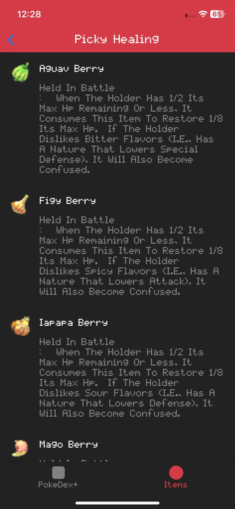
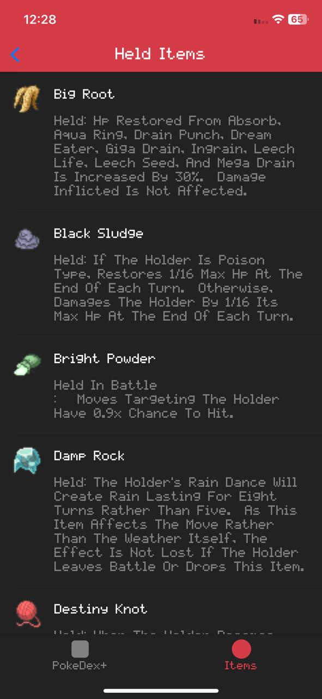
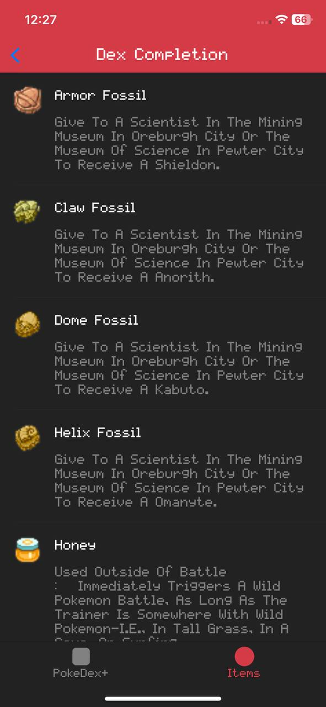

# PokeDexPlus

<h1 align="center">PokéDex+ - iOS App</h1>

<p align="center"></p>

> The Pokédex (ポケモン図鑑ずかん, Pokemon Zukan, Illustrated Pokémon Encyclopedia) is an electronic device created and designed to catalog and provide information regarding the various species of Pokémon featured in the Pokémon video game, anime and manga series. The name Pokédex is a neologism including "Pokémon" (which itself is a portmanteau of "pocket" and "monster") and "index". The Japanese name is simply "Pokémon Encyclopedia", as it can feature every Pokémon on it, depending on the Pokédex. - <a href="https://pokemon.fandom.com/wiki/Pok%C3%A9dex" target="_blank">Pokemon Fandom Wiki</a>

**PokéDex+** is a feature-packed Pokémon app that brings your favorite Pokémon to life with a sleek, user-friendly interface. It fetches data from the **PokéDex API** and displays a comprehensive list of Pokémon, their stats, and their most common items. With unique features like compositional layout, async image downloading, infinite scrolling, and more, PokéDex+ is built to deliver a polished user experience. The app is structured using the **RIB+VVM architecture**, an enhanced interpretation of the popular RIB architecture by Uber.

## Features:

- **Compositional Layout**: Beautiful grid and table views powered by compositional layouts for smooth scrolling and flexible UI.
- **Async Image Downloading and Caching**: Images of Pokémon are downloaded asynchronously with caching to provide faster access.
- **Network Capabilities using Combine**: Fetch Pokémon data efficiently with Combine for network requests.
- **Custom Navigation Bar & TabBar**: Custom navigation and tab bars for smooth and intuitive user experience.
- **Custom View Transitions**: Custom transitions between views to enhance the UI flow.
- **RIB+VVM Architecture**: The app follows the **RIB+VVM architecture** (Router, Interactor, Builder + View, ViewModel), designed for maintainable and scalable code.
- **Infinite Scrolling**: Seamlessly browse through Pokémon with infinite scrolling.
- **Custom Fonts**: Designed with custom fonts to create a unique look and feel.
- **Dominant Color Detection**: Each Pokémon's sprite is analyzed to display its most dominant color in the UI.
- **Most Common Items**: Shows a list of the most common items associated with Pokémon.

## Installation:

To run this project locally:

1. Clone the repository:
    ```bash
    git clone https://github.com/deepanshubajaj/PokeDexPlus.git
    ```

2. Open the project in Xcode:
    ```bash
    open SwiftPokedex.xcodeproj
    ```

3. Build and run the app on a simulator or physical device.

> Make sure you have Xcode installed and configured properly to run the project.

## API Reference:


Pokedex using the [PokeAPI](https://pokeapi.co/) for constructing RESTful API.<br>
PokeAPI provides a RESTful API interface to highly detailed objects built from thousands of lines of data related to Pokémon.

## App Look:

<p align="center">
  
</p>
<p align="center">
  *App snapshot in the simulator.*
</p>

## Screenshots:

<p align="center">
  
  
</p>

<p align="center">
  *Splash screen displayed upon app launch.*
</p>

<p align="center">
  <div style="display: flex; justify-content: center; gap: 10px;">
    
    
    
  </div>
</p>

<p align="center">
  <div style="display: flex; justify-content: center; gap: 10px;">
    
    
    
  </div>
</p>

<p align="center">
  <div style="display: flex; justify-content: center; gap: 10px;">
    
    
    
  </div>
</p>

<p align="center">
  <div style="display: flex; justify-content: center; gap: 10px;">
    
    
    
  </div>
</p>

<p align="center">
  <div style="display: flex; justify-content: center; gap: 10px;">
    
    
    
  </div>
</p>

<p align="center">
  <div style="display: flex; justify-content: center; gap: 10px;">
    
    
    
  </div>
</p>

<p align="center">
  <div style="display: flex; justify-content: center; gap: 10px;">
    
    
    
  </div>
</p>

<p align="center">
  <div style="display: flex; justify-content: center; gap: 10px;">
    
    
    
  </div>
</p>

<p align="center">
  <div style="display: flex; justify-content: center; gap: 10px;">
    
    
    
  </div>
</p>

<p align="center">
  <div style="display: flex; justify-content: center; gap: 10px;">
    
    
    
  </div>
</p>

<p align="center">
  <div style="display: flex; justify-content: center; gap: 10px;">
    
    
    
  </div>
</p>

<p align="center">
  <div style="display: flex; justify-content: center; gap: 10px;">
    
    
    
  </div>
</p>

<p align="center">
  <div style="display: flex; justify-content: center; gap: 10px;">
    
    
    
  </div>
</p>

<p align="center">
  <div style="display: flex; justify-content: center; gap: 10px;">
    
    
    
  </div>
</p>

<p align="center">
  <div style="display: flex; justify-content: center; gap: 10px;">
    
    
    
  </div>
</p>

<p align="center">
  <div style="display: flex; justify-content: center; gap: 10px;">
    
    
    
  </div>
</p>

<p align="center">
  <div style="display: flex; justify-content: center; gap: 10px;">
    
    
    
  </div>
</p>

<p align="center">
  <div style="display: flex; justify-content: center; gap: 10px;">
    
    
    
  </div>
</p>

<p align="center">
  <div style="display: flex; justify-content: center; gap: 10px;">
    
    
    
  </div>
</p>

<p align="center">
  <div style="display: flex; justify-content: center; gap: 10px;">
    
    
    
  </div>
</p>

<p align="center">
  *Screenshots of the PokéDex+ app showing different screens*
</p>

## App Icon:

<p align="center">
  
</p>
<p align="center">
  *The app icon reflects the PokéDex+ look*
</p>

## Video Demo:

Here’s a short video showcasing the app's functionality:

<p align="center">
  
</p>

[Watch Splash Screen Video](ProjectOutputs/WorkingVideo/splashScreen.mp4)
[Watch Working Video](ProjectOutputs/WorkingVideo/workingVideo.MP4)
